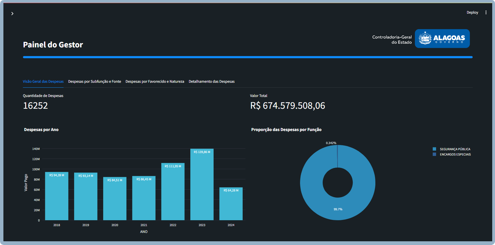
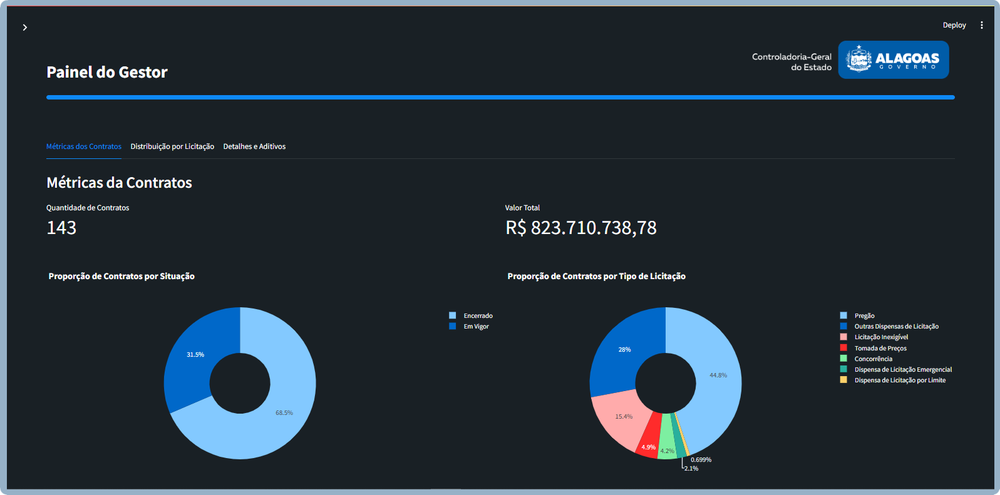
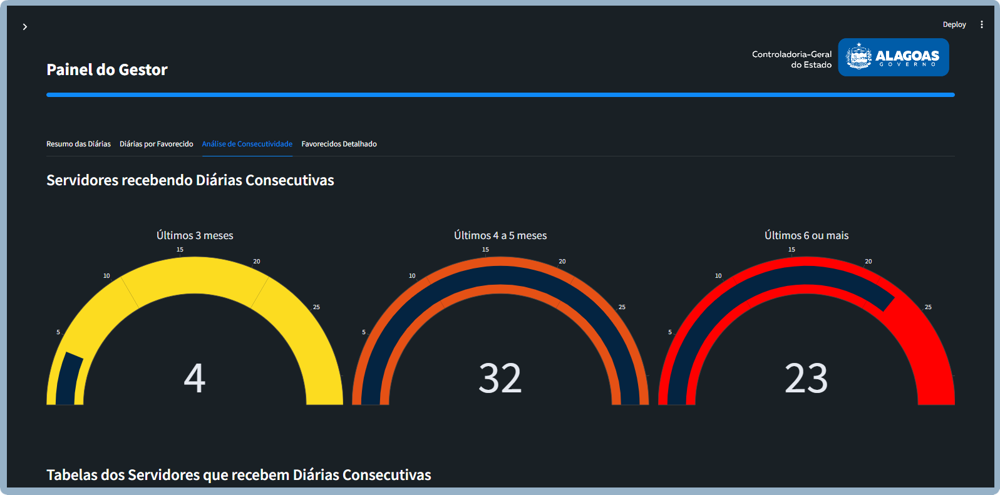
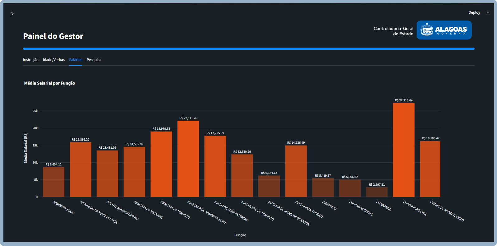

# Painel do Gestor

## 📊 Visão Geral

O **Painel do Gestor** é uma aplicação interativa desenvolvida com [Streamlit](https://streamlit.io/) para análise e visualização de dados públicos do Governo do Estado de Alagoas. Este painel tem como principal objetivo fornecer uma visão clara, acessível e segmentada sobre despesas, diárias, contratos, servidores, orçamento e adiantamentos, auxiliando a alta gestão na tomada de decisões e na promoção da transparência pública.

O projeto foi inicialmente documentado neste repositório no GitHub e, posteriormente, passou a ser mantido e atualizado pelo time de desenvolvimento da **Controladoria Geral do Estado (CGE)** em um novo repositório no GitLab do **Instituto de Tecnologia em Informática e Informação do Estado de Alagoas (ITEC/AL)**.

---

## 🧩 Módulos Desenvolvidos

### 📌 Despesas Detalhado
Permite análise minuciosa das despesas das unidades gestoras (UGs), possibilitando o acompanhamento mês a mês, comparações com anos anteriores, além de filtros específicos por UG e por natureza da despesa.



---

### 💼 Contratos
Apresenta os contratos firmados pelo Governo do Estado, com visualização de aditivos, reajustes e valores executados. Ideal para o acompanhamento de gastos contratuais em tempo real.



---

### ✈️ Diárias
Exibe o detalhamento das diárias pagas a servidores, com possibilidade de filtro por unidade, servidor e período. Uma importante ferramenta para o controle de gastos com deslocamentos.



---

### 🧑‍💻 Servidores
Oferece dados sobre servidores públicos, suas remunerações, funções e unidades de lotação. Inclui visualizações sobre o perfil do servidor, vínculos ativos e situação funcional.



---

### ⛽ Combustível
Monitora os gastos com combustíveis por parte das unidades gestoras, oferecendo uma visão consolidada e segmentada do consumo.

---

### 💰 Adiantamentos
Permite a análise de valores adiantados às UGs, com controle por tipo, destino e período. Os dados são coletados diretamente de planilhas oficiais e transformados em datasets Parquet para melhor performance.

---

### 📊 Orçamento
Apresenta um panorama orçamentário com receitas, despesas previstas e executadas, promovendo maior controle da execução financeira.

---

## ⚙️ Tecnologias Utilizadas

- **Python 3.8+**
- **Streamlit**
- **Pandas**
- **PyArrow**
- **Google API Python Client**
- **dotenv (.env) para variáveis sensíveis**
- **Google Drive API para upload automatizado dos dados**
- **Gráficos interativos e dashboards responsivos**

---

## 🚀 Estrutura do Projeto

```
painelgestor/
│
├── .streamlit/
│   └── config.toml
│
├── database/
│   └── UGS-COD-NOME-SIGLA.csv
│
├── src/assets/
│   ├── contratos_capab.png
│   ├── despesas_capab.png
│   ├── diarias_capab.png
│   ├── servidores_capab.png
│   └── logos
│
├── app.py                # Arquivo principal da aplicação
├── sidebar.py            # Menu lateral e navegação
├── home.py               # Página inicial com visão geral
├── despesas_ug.py        # Módulo de despesas
├── contratos.py          # Módulo de contratos
├── diarias.py            # Módulo de diárias
├── servidores.py         # Módulo de servidores
├── adiantamentos.py      # Módulo de adiantamentos
├── combustivel.py        # Módulo de combustível
├── orcamento.py          # Módulo de orçamento
├── data_loader.py        # Centralização da carga dos dados
├── chatbot.py            # Integração com IA (chatbot)
├── analyzer.py           # Integração com IA
├── auth_utils.py         # Utilitários de autenticação
├── requirements.txt      # Dependências do projeto
└── README.md             # Documentação inicial
```

---

## 📌 Continuidade do Projeto

Este repositório representa a **fase inicial** e estruturante do projeto *Painel do Gestor*, conduzida por **Mewerton de Melo Silva**, responsável pela concepção, arquitetura e desenvolvimento da versão base com uso intensivo de ETL automatizado, API com Google Drive, e estrutura modular em Streamlit.

A evolução e manutenção contínua do projeto passaram a ser conduzidas pela **equipe técnica da CGE**, com versionamento ativo no **GitLab do ITEC/AL**, onde novas funcionalidades, correções e melhorias estão sendo desenvolvidas.

---

## 📞 Contato

Para mais informações sobre o projeto original ou colaborações, entre em contato com o desenvolvedor:

**Mewerton de Melo Silva**  
Desenvolvedor de Software e Analista de Dados – CGE/AL  
[LinkedIn](https://www.linkedin.com/in/mewerton/) | mewerton@gmail.com

---

**Painel do Gestor** – Um compromisso com a **transparência**, **inovação** e a **eficiência pública**.
