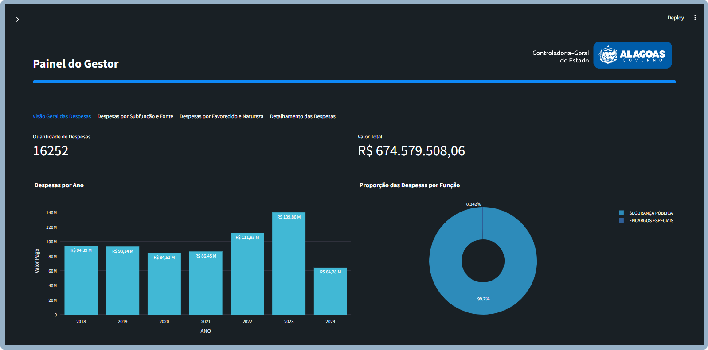
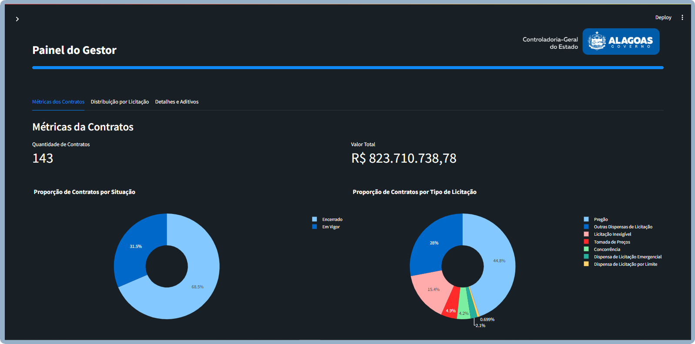
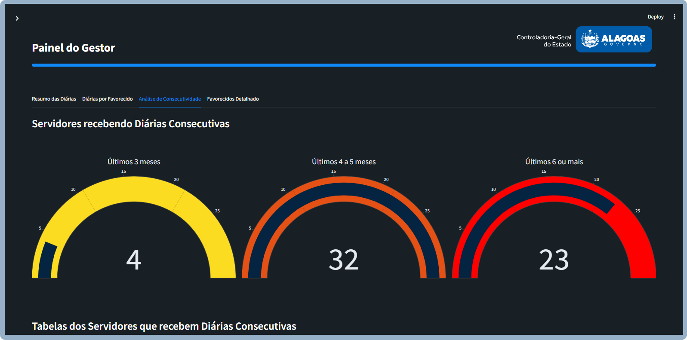
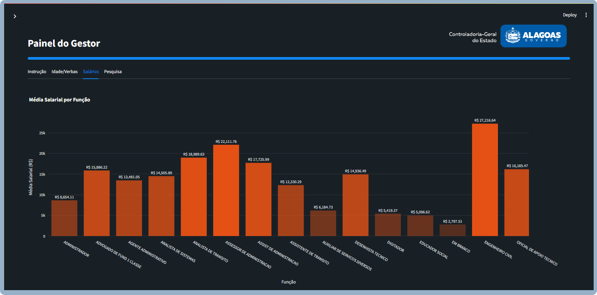

# 🏛️ Government Manager Dashboard

## 📊 Overview

The **Government Manager Dashboard** is an interactive application built with [Streamlit](https://streamlit.io/) for analyzing and visualizing public data from the Government of the State of Alagoas. The main goal of this dashboard is to provide a clear, accessible, and segmented view of public expenditures, daily allowances, contracts, public servants, budget, and advances, supporting high-level decision-making and promoting public transparency.

The project was initially documented in this GitHub repository and later maintained and updated by the development team of the **State Comptroller’s Office (CGE)** in a new GitLab repository at the **Institute of Information Technology and Information of the State of Alagoas (ITEC/AL)**.

---

## 🧩 Developed Modules

### 📌 Detailed Expenses
Provides in-depth analysis of expenditures by government units (UGs), allowing month-to-month tracking, year-over-year comparisons, and filtering by unit and expense category.



---

### 💼 Contracts
Displays contracts signed by the State Government, including amendments, adjustments, and executed amounts. It is designed for real-time monitoring of contractual spending.



---

### ✈️ Daily Allowances
Shows detailed information about per diem payments to public servants, with filters by unit, employee, and time period. An important tool for monitoring travel-related expenses.



---

### 🧑‍💻 Public Servants
Provides data on public employees, including salaries, roles, and assigned units. It includes visualizations of employee profiles, active employment relationships, and functional status.



---

### ⛽ Fuel
Monitors fuel expenses across government units, providing a consolidated and segmented view of consumption.

---

### 💰 Advances
Enables analysis of advance payments made to government units, including type, purpose, and time period. Data is collected from official spreadsheets and transformed into Parquet datasets for performance optimization.

---

### 📊 Budget
Presents an overview of the state budget, including revenues, planned expenditures, and actual execution, improving financial control and transparency.

---

## ⚙️ Technologies Used

- Python 3.8+
- Streamlit
- Pandas
- PyArrow
- Google API Python Client
- dotenv (.env for environment variables)
- Google Drive API for automated data upload
- Interactive charts and responsive dashboards

---

## 🚀 Project Structure

```
painelgestor/
│
├── .streamlit/
│   └── config.toml
│
├── database/
│   └── UGS-COD-NOME-SIGLA.csv
│
├── src/assets/
│   ├── contratos_capab.png
│   ├── despesas_capab.png
│   ├── diarias_capab.png
│   ├── servidores_capab.png
│   └── logos
│
├── app.py                # Main application file
├── sidebar.py            # Navigation sidebar
├── home.py               # Home page overview
├── despesas_ug.py        # Expenses module
├── contratos.py          # Contracts module
├── diarias.py            # Daily allowances module
├── servidores.py         # Public servants module
├── adiantamentos.py      # Advances module
├── combustivel.py        # Fuel module
├── orcamento.py          # Budget module
├── data_loader.py       # Centralized data loading
├── chatbot.py           # AI chatbot integration
├── analyzer.py          # AI analysis integration
├── auth_utils.py        # Authentication utilities
├── requirements.txt      # Project dependencies
└── README.md             # Documentation
```

---

## 📌 Project Continuity

This repository represents the **initial and foundational phase** of the *Government Manager Dashboard*, led by **Mewerton de Melo Silva**, responsible for its conception, architecture, and core development using automated ETL processes, Google Drive API integration, and a modular Streamlit structure.

The ongoing evolution and maintenance of the project have been transferred to the **technical team of CGE**, with active versioning in the **ITEC/AL GitLab repository**, where new features, fixes, and improvements continue to be developed.

---

## 📞 Contact

For more information about the original project or collaborations, please contact:

**Mewerton de Melo Silva**  
Software Developer and Data Analyst – CGE/AL  
[LinkedIn](https://www.linkedin.com/in/mewerton/) | mewerton@gmail.com

---

**Government Manager Dashboard** – A commitment to **transparency**, **innovation**, and **public efficiency**.
